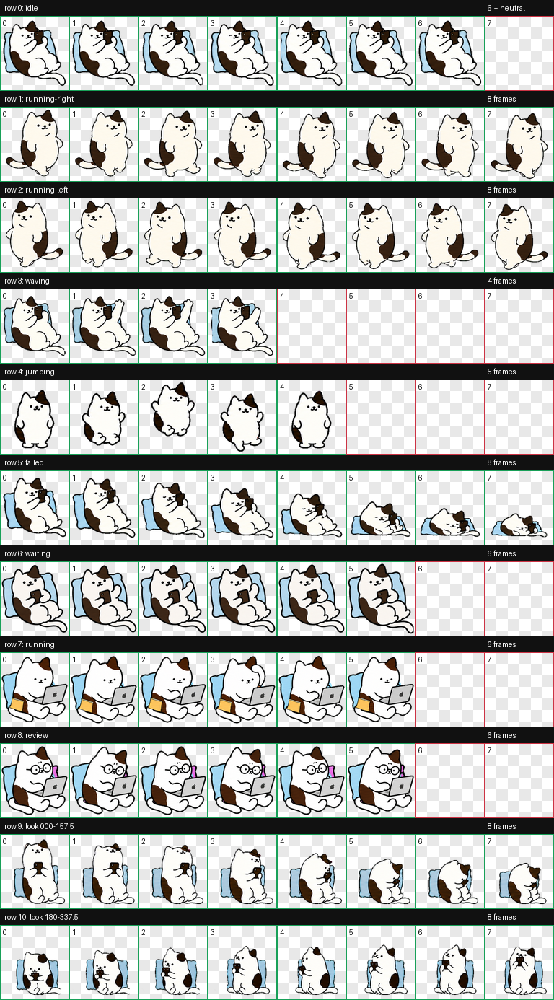

# 태식이 — Codex Pet v2

태식이는 쿠션에 기대 휴대폰을 보는 통통한 삼색 고양이 Codex 펫입니다. 작업 중에는 노트북을 사용하고, 검토할 때는 안경을 쓰며, 사용자 입력이 필요할 때는 휴대폰을 내리고 작은 손짓으로 기다립니다.



## 주요 상태

| 상태 | 동작 |
| --- | --- |
| Waiting | 휴대폰을 내리고 사용자를 바라보며 답을 기다림 |
| Running | 노트북으로 작업을 진행함 |
| Review | 안경을 쓰고 결과를 검토함 |


## 설치

macOS에서 다음 명령을 실행합니다. 기존 `phone-cat` 설치본이 있으면 설치 스크립트가 저장소 내부 파일을 덮어쓰기 전에 시간표시 백업을 생성합니다.

```bash
./scripts/install.sh
```

수동 설치 경로는 다음과 같습니다.

```text
~/.codex/pets/phone-cat/pet.json
~/.codex/pets/phone-cat/spritesheet.webp
```

설치 후 Codex를 다시 열거나 펫 선택 화면에서 태식이를 다시 선택합니다.

## 검증

Python 3.11 이상과 Pillow가 필요합니다.

```bash
python3 -m pip install -r requirements.txt
python3 scripts/validate_pet.py
```

검증기는 다음을 확인합니다.

- `spriteVersionNumber: 2`
- 1536×2288 RGBA WebP와 8×11 셀 구조
- 사용 프레임과 빈 프레임의 정확한 배치
- 투명 픽셀의 숨은 RGB 잔여 여부
- `waiting`과 `running` 행이 실제로 다른지
- 배포 파일의 SHA-256

상세 QA 증거는 [`qa/`](qa/)에 있습니다. 방향 행은 이전 승인 v13과 픽셀 단위로 동일하며, 이번 릴리스에서는 `waiting` 행만 교체했습니다.

## 파일 구성

```text
pet/       설치에 필요한 최종 파일
preview/   전체 시트와 대표 애니메이션
qa/        구조·방향·연속성·시각 검증 결과
scripts/   설치 및 독립 검증 도구
source/    이번 보정에 사용한 생성 프롬프트
```

## 라이선스

현재 저장소는 별도 재사용 허가를 부여하지 않습니다. 자세한 내용은 [LICENSE](LICENSE)를 확인하세요.
